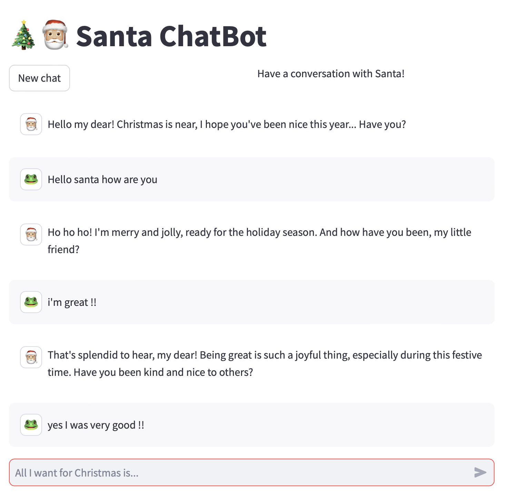
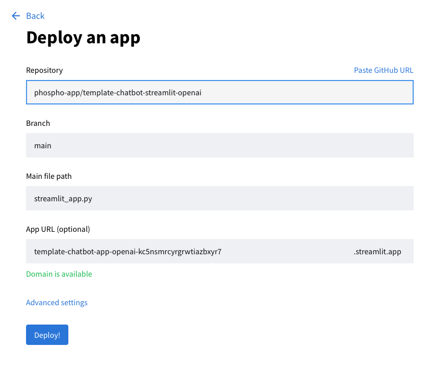
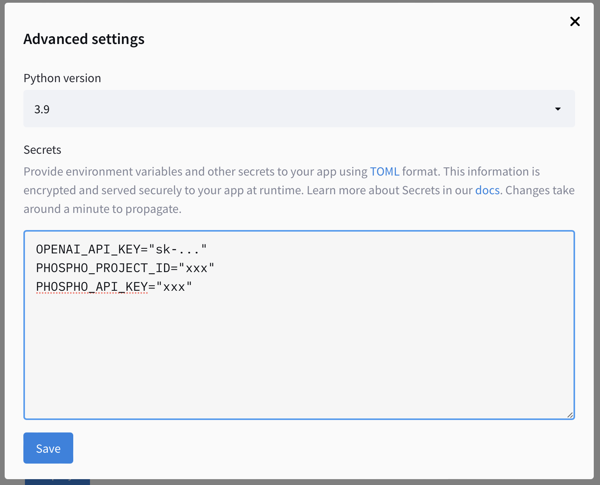
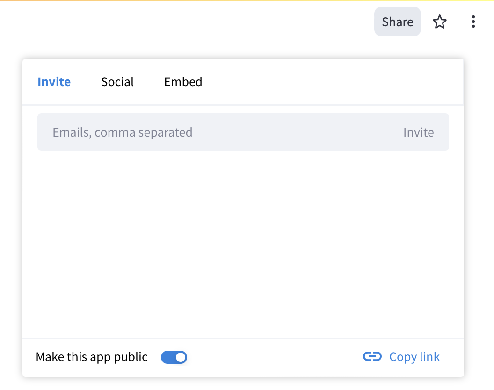
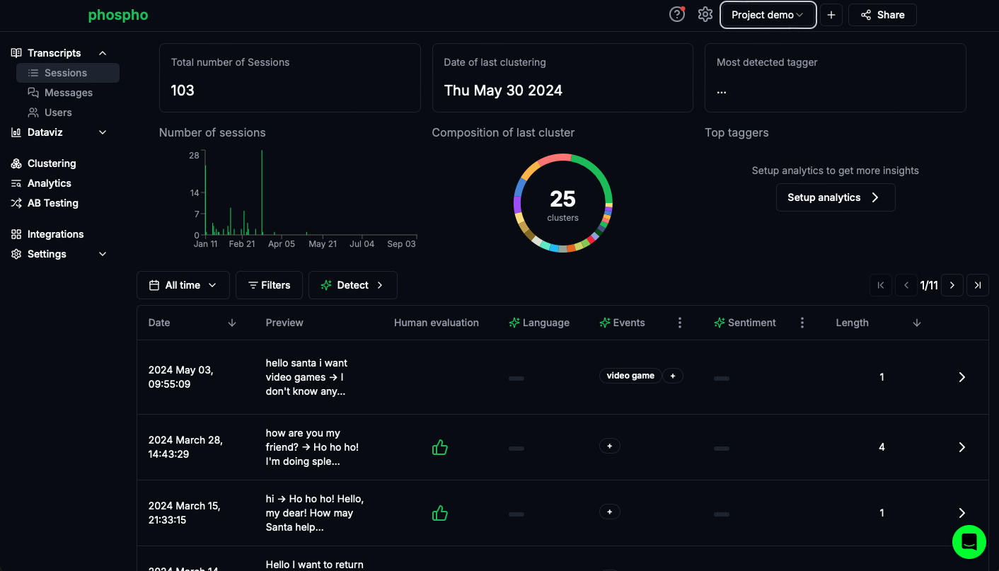

# Template chatbot Streamlit OpenAI

Template for a simple LLM chatbot using a Streamlit UI, and OpenAI or Mistral as a provider.

The chatbot is a quirky Santa Claus, which uses token streaming, random introductions, user feedback, and logging to [phospho.](https://phospho.ai)

Demo: [**--> Click here to chat now with Santa Claus!**](https://template-chatbot-app-openai-kc5nsmrcyrgrwtiazbxyr7.streamlit.app)



## Architecture

- `streamlit_app.py`: Streamlit user interface. Edit this to change the look and feel of the app.
- `agent.py`: Chatbot logic and system prompts. Edit this to change the behaviour of the chatbot.

## Run locally

1. Get your OpenAI API key [here](https://platform.openai.com)
2. Setup your phospho project [here](http://platform.phospho.ai)
3. Git clone the project

```bash
git clone git@github.com:phospho-app/template-chatbot-streamlit-openai.git
```

4. Create a `secrets.toml` file in the `.streamlit` folder.

```toml secrets.toml
OPENAI_API_KEY="xxx"
MISTRAL_API_KEY="xxx" # Optional, if you set provider to "mistral" in `main.py`
PHOSPHO_PROJECT_ID="xxx"
PHOSPHO_API_KEY="xxx"
```

4. Install requirements. You need Python `>=3.9`

```bash
# Optional: create a virtual env
python -m venv .env
# To activate the virtual env on MacOS and Linux:
source .env/bin/activate
# To activate the virtual env on Windows:
source .env/Scripts/activate

# Install requirements
pip install -r requirements.txt
```

5. Run!

```bash
streamlit run streamlit_app.py
```

## Deploy on Streamlit Community Cloud

The easiest way to deploy the chatbot on internet is with Streamlit Community Cloud.

1. Fork [this repository](https://github.com/phospho-app/template-chatbot-streamlit-openai) while connected to your github account. _The Fork button is on the top right._

2. Login or register to [Streamlit share](https://share.streamlit.io) with the same github account

3. On Streamlit share, click on "New App".


4. In the form, select your fork of the phospho repo. If you don't see the repo in the list, you can paste the URL.

5. In the main file path, enter `streamlit_app.py`



6. Click on _Advanced Settings_, and add the content of the `secrets.toml` file:

```toml secrets.toml
OPENAI_API_KEY="xxx"
PHOSPHO_PROJECT_ID="xxx"
PHOSPHO_API_KEY="xxx"
```



7. Hit Save, and click deploy. Streamlit will now deploy your app on internet. Once it's done, click on the _Share button_ on the top-right to share your Santa Claus chatbot.



Have a chat with your agent!

## Analyze the logs

After talking to your agent, go to the [phospho dashboard](https://platform.phospho.app) to see the logs.



Run a clustering or create custom analytics to detect specific patterns in conversations.

## Get in touch

An issue? Special request? Feel free to reach out to *contact@phospho.ai* for technical questions, job opportunities, and anything else.
